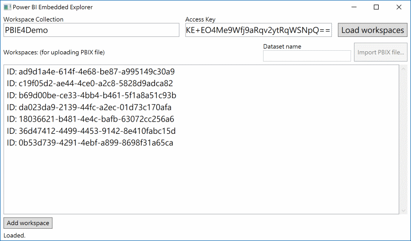

# Power-BI-Embedded-Explorer
A GUI Tool for Manipulating Power BI Embedded. You can provision a workspace in given workspace collection and import a PBIX file into the workspace.

This project has adopted the [Microsoft Open Source Code of Conduct](https://opensource.microsoft.com/codeofconduct/). For more information see the [Code of Conduct FAQ](https://opensource.microsoft.com/codeofconduct/faq/) or contact [opencode@microsoft.com](mailto:opencode@microsoft.com) with any additional questions or comments.